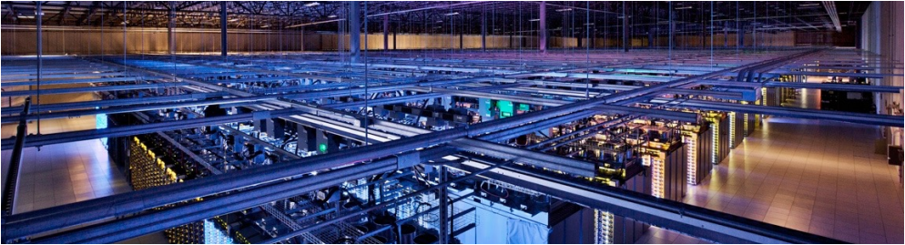
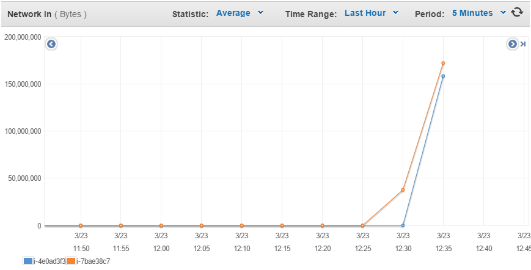

# LAB 02: APP SCALING ON AMAZON WEB SERVICES



Link to the full lab [here](https://cyberlearn.hes-so.ch/mod/assign/view.php?id=551613)  

## TASK 1: CREATE A DATABASE USING THE RELATIONAL DATABASE SERVICE (RDS)
#### DELIVERABLE 1:

The endpoint address of the database:
```
zundler-drupa.cgcjxeuocv6f.eu-central-1.rds.amazonaws.com
```
 Compare EC2 and RDS if it were running continuously for a month:  
+ RDS monthly bill : $15.33  
+ EC2 monthly bill : $10.98  

(Region Frankfurt, t2.micro)

In a two-tier architecture the web application and the database are kept separate and run on different hosts. Imagine that for the second tier instead of using RDS to store the data you would create a virtual machine in EC2 and install and run yourself a database on it. If you were the Head of IT of a medium-size business, how would you argue in favor of using a database as a service instead of running your own database on an EC2 instance? How would you argue against it?

Faut répondre à ça laurent ! 

## TASK 2: CONFIGURE THE DRUPAL MASTER INSTANCE TO USE THE RDS DATABASE
####  DELIVERABLE 2:
The content of the generated file /etc/drupal/7/sites/default/dbconfig.php:  
```php
?php
$databases['default']['default'] = array(
        'driver' => 'mysql',
        'database' => 'drupal7',
        'username' => 'drupal7',
        'password' => '1234',
        'host' => 'zundler-drupa.cgcjxeuocv6f.eu-central-1.rds.amazonaws.com',
        'port' => '',
        'prefix' => ''
);
?>
```

## TASK 3: CREATE A CUSTOM VIRTUAL MACHINE IMAGE
####  DELIVERABLE 3:
Screenshot of the AWS console showing the AMI parameters:  


## TASK 4: CREATE A LOAD BALANCER
####  DELIVERABLE 4:

Nslookup :
```
PS C:\Users\st4ck\Documents\HEIG-VD\S6\CLD\CLD_LABO> nslookup Zundler-Drupal-1068779716.eu-central-1.elb.amazonaws.com
Serveur :   ns01.heig-vd.ch
Address:  10.192.22.5

Réponse ne faisant pas autorité :
Nom :    Zundler-Drupal-1068779716.eu-central-1.elb.amazonaws.com
Addresses:  52.29.19.58
          52.29.147.251
```

health check :
```
20 "-" "ELB-HealthChecker/1.0"
172.31.6.155 - - [20/Mar/2015:10:18:32 +0000] "GET /index.html HTTP/1.1" 200 118
20 "-" "ELB-HealthChecker/1.0"
172.31.6.155 - - [20/Mar/2015:10:18:42 +0000] "GET /index.html HTTP/1.1" 200 118
20 "-" "ELB-HealthChecker/1.0"
172.31.26.84 - - [20/Mar/2015:10:18:43 +0000] "GET /index.html HTTP/1.1" 200 118
20 "-" "ELB-HealthChecker/1.0"
172.31.26.84 - - [20/Mar/2015:10:18:52 +0000] "GET /index.html HTTP/1.1" 200 118
```

## TASK 5: LAUNCH A SECOND INSTANCE FROM THE CUSTOM IMAGE
####  DELIVERABLE 5:

Diagram of our setup on AWS :


corresponding Security-Group :


**Note:** Security-Group are permissive, we can filter more precisely but for this lab we just made simple filtering to the objective that everything works. Note that icmp is required if you want that the ELB can check status of the instances.

Total cost of the setup :  
+ $59.25

That include ELB, RDS(t2.micro) and 2 instance (t2.micro).

## TASK 6: TEST THE DISTRIBUTED APPLICATION
####  DELIVERABLE 6:

Document your observations. Include screenshots of JMeter and the AWS console monitoring output.

We simply configured JMeter to make a GET request on default test front page.
The test plan is 100 threads that make get request until we stop the test.


Here is the output after the stop of the test. We can see ~30'000 request were send. ~40% fail we get 5XX status


We can see the network load is increasing when I start the JMeter test on both EC2 instance. The requests switch between instances (round robin). Here is différents monitoring info on the two EC2 instances :




I have nothings particular to say, just we saw the traffic is shared between the instances. That because the when we request for Zundler-Drupal-1068779716.eu-central-1.elb.amazonaws.com/drupal7/ the DNS return us two IP that are all time switched between request and our browser select the first one.

When you resolve the DNS name of the load balancer into IP addresses while the load balancer is under high load what do you see? Explain.

It change nothing, no matter the Load Balancer is under heavy load or not. That's because the DNS return us the two IP of EC2 instance with round robin switch and our browser just select the first one so we switch between two instance.

The Nslookup comamnd show that ip address switch between each command and this what ever the load is.

```
PS C:\Users\st4ck\Documents\HEIG-VD\S6\CLD\CLD_LABO> nslookup Zundler-Drupal-1068779716.eu-central-1.elb.amazonaws.com
Serveur :   ns01.heig-vd.ch
Address:  10.192.22.5

Réponse ne faisant pas autorité :
Nom :    Zundler-Drupal-1068779716.eu-central-1.elb.amazonaws.com
Addresses:  52.29.19.58
          52.29.147.251

PS C:\Users\st4ck\Documents\HEIG-VD\S6\CLD\CLD_LABO> nslookup Zundler-Drupal-1068779716.eu-central-1.elb.amazonaws.com
Serveur :   dnsman.heig-vd.ch
Address:  10.192.22.5

Réponse ne faisant pas autorité :
Nom :    Zundler-Drupal-1068779716.eu-central-1.elb.amazonaws.com
Addresses:  52.29.147.251
          52.29.19.58
```

Did this test really test the load balancing mechanism? What are the limitations of this simple test? What would be necessary to do realistic testing?

No ! Actually it just test the round robin mechanism made by the DNS :) . That's because we have only one instance by Availability zone and one IP of ELB corresponding to one availability zone. So if we really want to test the load balancer we have to  run at least two instances by availability zone, because of two IPs returned by the DNS each one corresponding in one availability zone of the load balancer and we have one instance of EC2 for each availability zone. It's like we have one to one matching IP1_ELB -> IP1_EC2 / IP2_ELB -> IP2_EC2.

**Other note:** The RDS seem to limit the number of request, on 30K request we get ~ 40% of 5XX response.
