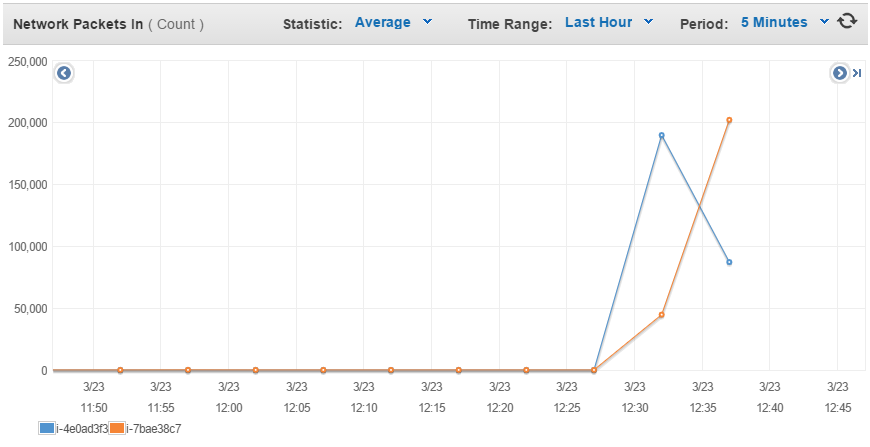

# LAB 02: APP SCALING ON AMAZON WEB SERVICES


Link to the full lab [here](https://cyberlearn.hes-so.ch/mod/assign/view.php?id=551613)

**Assignment from:** Laurent girod & Cyrill Zundler


## TASK 1: CREATE A DATABASE USING THE RELATIONAL DATABASE SERVICE (RDS)
#### DELIVERABLE 1:

The endpoint address of the database is:
```
zundler-drupa.cgcjxeuocv6f.eu-central-1.rds.amazonaws.com
```

By using the Simple Monthly Calculator, a comparison between an EC2 instance and a RDS, (both running continuously for one month) was computed:  
+ RDS monthly bill : $15.33  
+ EC2 monthly bill : $10.98  

(Region Frankfurt, t2.micro)

*In a two-tier architecture the web application and the database are kept separate and run on different hosts. Imagine that for the second tier instead of using RDS to store the data you would create a virtual machine in EC2 and install and run yourself a database on it. If you were the Head of IT of a medium-size business, how would you argue in favor of using a database as a service instead of running your own database on an EC2 instance? How would you argue against it?*

**Arguments in favour of RDS**


+ It is easier to administer, because the infrastructure and software (database and backups) are put in place by Amazon.
+ It is more scalable, a RDS can be redimensioned without interruption. Amazon also offers the possibility to have read-only replicas of a RDS, (which is a efficient way to improve it since there are generally far more reads than writes on a database).
+ It is more secure, Amazon maintains a synchronous copy of the RDS in a different availability zone, in case of a failure the operations are switched to the other RDS.

**Arguments against RDS**

+ It costs more than having the database in the EC2 instance.
+ If the system administrator(s) has/have never used a RDS, it would require him/her/them to learn how to manage them.

**Note:** Some of these arguments come from Amazon's explanations <https://aws.amazon.com/fr/rds/>.

## TASK 2: CONFIGURE THE DRUPAL MASTER INSTANCE TO USE THE RDS DATABASE
####  DELIVERABLE 2:
The content of the generated file ``/etc/drupal/7/sites/default/dbconfig.php`` is:  
```php
?php
$databases['default']['default'] = array(
        'driver' => 'mysql',
        'database' => 'drupal7',
        'username' => 'drupal7',
        'password' => '1234',
        'host' => 'zundler-drupa.cgcjxeuocv6f.eu-central-1.rds.amazonaws.com',
        'port' => '',
        'prefix' => ''
);
?>
```

## TASK 3: CREATE A CUSTOM VIRTUAL MACHINE IMAGE
####  DELIVERABLE 3:
Here are the screen captures of the AWS console showing the AMI parameters:  


## TASK 4: CREATE A LOAD BALANCER
####  DELIVERABLE 4:

The output of the ``nslookup`` command is :
```
PS C:\Users\st4ck\Documents\HEIG-VD\S6\CLD\CLD_LABO> nslookup Zundler-Drupal-1068779716.eu-central-1.elb.amazonaws.com
Serveur :   ns01.heig-vd.ch
Address:  10.192.22.5

Réponse ne faisant pas autorité :
Nom :    Zundler-Drupal-1068779716.eu-central-1.elb.amazonaws.com
Addresses:  52.29.19.58
          52.29.147.251
```

Here is a sample of the health check access from the load balancer recorded in Apache's access logs:
```
20 "-" "ELB-HealthChecker/1.0"
172.31.6.155 - - [20/Mar/2015:10:18:32 +0000] "GET /index.html HTTP/1.1" 200 118
20 "-" "ELB-HealthChecker/1.0"
172.31.6.155 - - [20/Mar/2015:10:18:42 +0000] "GET /index.html HTTP/1.1" 200 118
20 "-" "ELB-HealthChecker/1.0"
172.31.26.84 - - [20/Mar/2015:10:18:43 +0000] "GET /index.html HTTP/1.1" 200 118
20 "-" "ELB-HealthChecker/1.0"
172.31.26.84 - - [20/Mar/2015:10:18:52 +0000] "GET /index.html HTTP/1.1" 200 118
```

## TASK 5: LAUNCH A SECOND INSTANCE FROM THE CUSTOM IMAGE
####  DELIVERABLE 5:

Here is the diagram of this laboratory's setup on AWS:


With the corresponding security group:


**Note:** The security groups are permissive, it is possible to configure a finer filter, but for the scope of this laboratory, a simple filtering was implemented such that the web server and MySQL works correctly. It is necessary to allow ``icmp`` to allow the ELB to check status of the instances.

Using the Simple Monthly Calculator, the total cost of the setup (for one month) was calculated:
+ $59.25

Which includes the ELB, the RDS (t2.micro) and 2 instance (t2.micro).

## TASK 6: TEST THE DISTRIBUTED APPLICATION
####  DELIVERABLE 6:

*Document your observations. Include screenshots of JMeter and the AWS console monitoring output.*

The test plan was prepared on JMeter. It consist of 100 threads making ``GET`` requests (to the default test front page) constantly until the test is stopped.


Here is the output after the test was stopped. We observe that about 30000 request were send. About 43% of them failed and got a 5xx status.


We observe that the network load is increasing when the JMeter test is started. The requests switch between the EC2 instances (in a similar manner as in a round robin). Here are different monitoring informations on the two EC2 instances:





The traffic is shared between the instances. When a DNS request is made to ``Zundler-Drupal-1068779716.eu-central-1.elb.amazonaws.com`` the DNS server return two IP addresses. Those addresses are switched between each requests and our browser select the first one.

*When you resolve the DNS name of the load balancer into IP addresses while the load balancer is under high load what do you see? Explain.*

This "DNS switching" mechanism can be viewed as a first level load balancing: When a query is made, it is first redirected to one of the availability zone, this in round-robin (to redirect the clients among the availability zones in uniform manner). The load balancer *per se* works as a "second level load balancer": When a request which was already directed to this load balancer by the DNS arrives, the load balancer will direct it to one of the EC2 instances inside the same availability zone (this depending on the load balancer traffic redirection strategy).

This switching mechanism is particularly evident with the ``nslookup` comamnd, that whatever the load is.

```
PS C:\Users\st4ck\Documents\HEIG-VD\S6\CLD\CLD_LABO> nslookup Zundler-Drupal-1068779716.eu-central-1.elb.amazonaws.com
Serveur :   ns01.heig-vd.ch
Address:  10.192.22.5

Réponse ne faisant pas autorité :
Nom :    Zundler-Drupal-1068779716.eu-central-1.elb.amazonaws.com
Addresses:  52.29.19.58
          52.29.147.251

PS C:\Users\st4ck\Documents\HEIG-VD\S6\CLD\CLD_LABO> nslookup Zundler-Drupal-1068779716.eu-central-1.elb.amazonaws.com
Serveur :   dnsman.heig-vd.ch
Address:  10.192.22.5

Réponse ne faisant pas autorité :
Nom :    Zundler-Drupal-1068779716.eu-central-1.elb.amazonaws.com
Addresses:  52.29.147.251
          52.29.19.58
```

*Did this test really test the load balancing mechanism? What are the limitations of this simple test? What would be necessary to do realistic testing?*

No, it just tests the round robin mechanism made by the DNS. That, because the two IP adresses returned by the DNS server are corresponding each to the load balancer in one availability zone. There is only one instance by availability zone and one IP address by ELB (corresponding to one availability zone).

To test the load balancer, it would be necessary to run at least two instances by availability zone. Since there is only one instance of EC2 for each availability zone, the task of the load balancer is rather monotonous, it essentially do a one to one matching IP1_ELB -> IP1_EC2 / IP2_ELB -> IP2_EC2. With more EC2 instances on the same availability zone, the load-balancer will works proberly by redirecting the traffic between instances (in the same availability zone).

**Other note:** The RDS seem to limit the number of request, on about 30K requests we get about 43% of 5XX responses. We have no explanation for it.

30047 request were send with JMeter (5731 + 4288 +5796 +4869 + 5777 + 3586) :


Here is 2XX status response :


Here is 5XX status response :


These graphics are from the ELB monitoring page.
