# LAB 02: PAAS - GOOGLE APP ENGINE


Link to the full lab [here](https://cyberlearn.hes-so.ch/mod/assign/view.php?id=555052)

**Assignment from:** Laurent girod & Cyrill Zundler


## TASK 1: DEPLOYMENT OF A SIMPLE WEB APPLICATION
#### DELIVERABLE 1:

.java file :
the code of the project our project, can include servlets, business logic, Data entity, Storage service, etc.

web.xml :
 Determine how URLs map to servlets, which URLs require authentication, and other information.

appengine-web.xml:
Project proprieties for AppEngine services deployment, example our App ID.

## TASK 2: DEVELOP A SERVLET THAT USES THE DATASTORE
####  DELIVERABLE 2:

Here is the source of the servlet :

```java
package ch.heigvd.cld.lab;

import java.io.IOException;
import java.io.PrintWriter;
import java.util.Enumeration;

import javax.servlet.ServletException;
import javax.servlet.http.*;

import com.google.appengine.api.datastore.DatastoreService;
import com.google.appengine.api.datastore.DatastoreServiceFactory;
import com.google.appengine.api.datastore.Entity;

@SuppressWarnings("serial")
public class DatastoreWriteServlet extends HttpServlet {
	@Override
	protected void doGet(HttpServletRequest req, HttpServletResponse resp)
			throws ServletException, IOException {

		Entity entity;
		resp.setContentType("text/plain");
		PrintWriter pw = resp.getWriter();
		pw.println("These Data will be wrote to the datastore");

		/* get parameters from passed from the url */
		String kind = req.getParameter("_kind");
		String key  = req.getParameter("_key");

		/* check that at least _kind is passed trought the URL */
		if(kind == null){
			pw.println("No entity '_kind' in these targeted URL, nothing can be done");
			return;
		}

        /* We create the entity no matter _key is passed or not */
        if(key != null)
        	entity = new Entity(kind,key);
        else
        	entity = new Entity(kind);

        /* We iterate trought others params passed to the urls */
		String tmp;
		@SuppressWarnings("unchecked")
		Enumeration<String> listParam = req.getParameterNames();

        pw.println("kind = " + kind);
		pw.println("key = " + key);
		while(listParam.hasMoreElements()){

			tmp = listParam.nextElement().toString();

			/* we don't process again kind and key because they are processed before */
			if(tmp.compareTo("_kind") == 0 || tmp.compareTo("_key") == 0)
				continue;

			pw.println(tmp + " = " + req.getParameter(tmp));
			entity.setProperty(tmp, req.getParameter(tmp));
		}

		/* Write it to the datastore */
		DatastoreService datastore = DatastoreServiceFactory.getDatastoreService();
        datastore.put(entity);
	}
}
```
***Note:*** I put all in the same file entity, business logic, it's just for the assignment purpose... (if M. Liechti saw that...)

here is Local Datastore :  

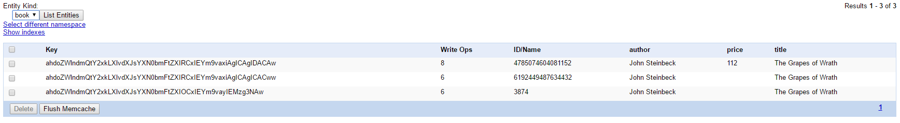  

Here is Google Datastore:  

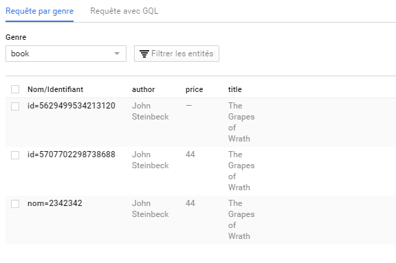

## TASK 3: TEST THE PERFORMANCE OF DATASTORE WRITES
####  DELIVERABLE 3:

***Default Servlet :***  
Here is the jmetter configuration for test :

+ Thread Group -> number of thread : 2000  
+ Thread Group -> loop count : 1  
+ HTTP Request -> Server name or IP : 1-dot-heigvd-cld-yourlastname.appspot.com
+ HTTP Request -> Path : /labo03

(I fail the name during creation yourlastname should have been zundler... sry for that)


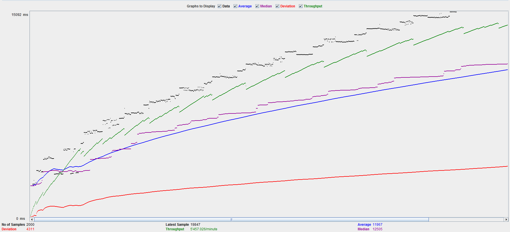


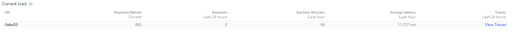

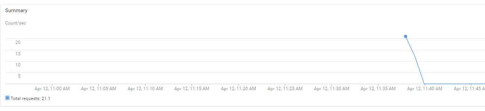

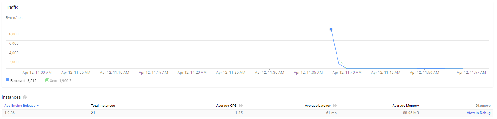

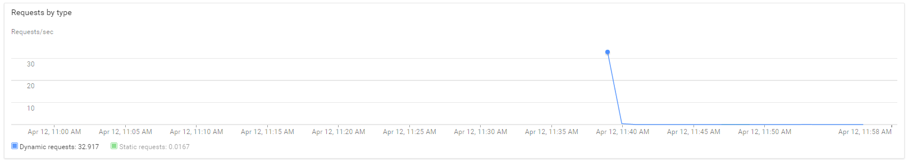

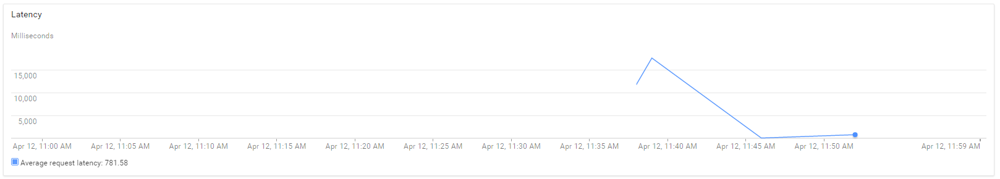

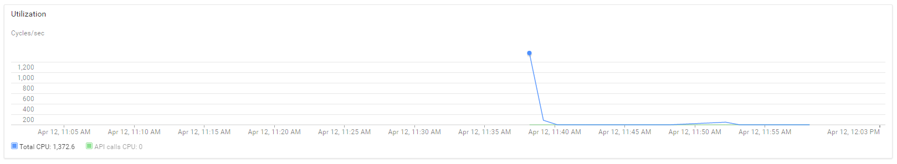  

***DatastoreWrite Servlet :***
Here is the jmetter configuration for test :

+ Thread Group -> number of thread : 2000  
+ Thread Group -> loop count : 1  
+ HTTP Request -> Server name or IP : 1-dot-heigvd-cld-yourlastname.appspot.com
+ HTTP Request -> Path : /datastorewrite?\_kind=book&author=John%20Steinbeck&title=The%20Grapes%20of%20Wrath

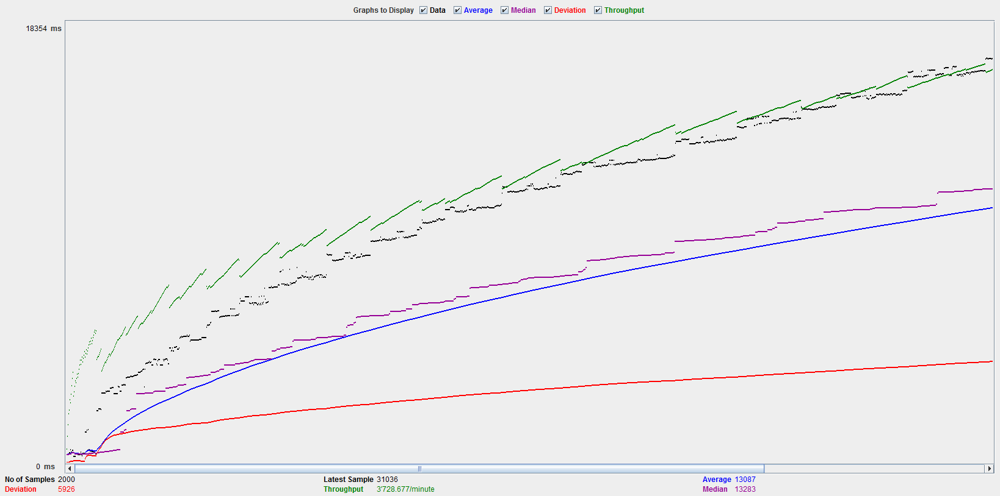  

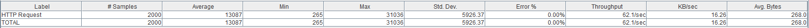  

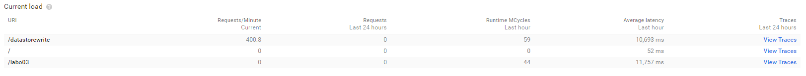

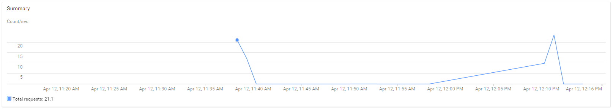

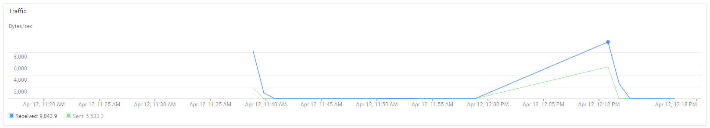

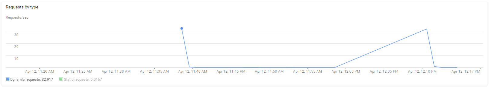

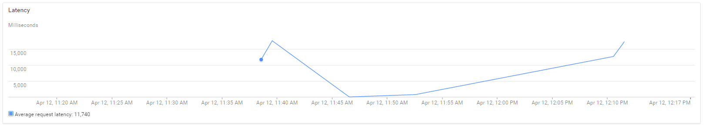

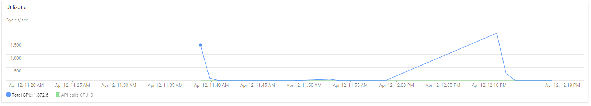  


##### What response times do you observe in the test tool for each Servlet?

##### Compare the response times shown by the test tool and the App Engine console. Explain the difference.

##### How much resources have you used running these tests? From the Quota Details view of the console determine the non-zero resource quotas (Daily quota different from 0%). Explain each with a sentence. To get a sense of everything that is measured click on Show resources not in use.  

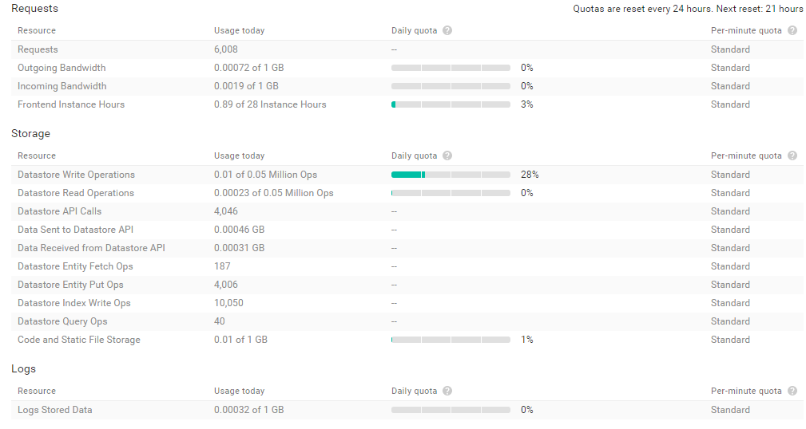  

+ Requests : number of request our Web App
+ Outgoing Bandwidth : 	nothing to say, Outgoing traffic BW (quotas : 1GB/24 hours)
+ Incoming Bandwidth : nothing to say, Outgoing traffic BW (quotas : 1GB/24 hours)
+ Frontend Instance Hours : number of instance of frontend deployed to handle traffic (quotas 28 instances/hours)
+ Datastore Write Operations : write operations to the datastore (quotas : 0.05 Million Ops/24 hours)
+ Datastore Read Operations : read operations to the datastore (quotas : 0.05 Million Ops/24 hours)

+ Code and Static File Storage : the size of our code project (size out our sources)

##### Let's suppose you become suspicious that the automatic scaling of instances is not working correctly. How would you use the App Engine console to verify? Give an example of how the automatic scaling could fail. Which measures shown in the console would you use to detect this failure?

We just can send tons of request on our Web App, then check on the Google console that instances number increase, we can check latency too  if scaling of instance fail, latency will increase when we send tens of thousands of request, and instance number wouldn't increase properly.
