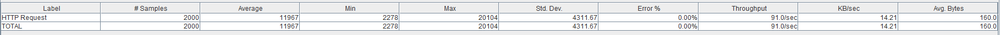

# LAB 03: PAAS - GOOGLE APP ENGINE


Link to the full lab [here](https://cyberlearn.hes-so.ch/mod/assign/view.php?id=555052)

**Assignment from:** Laurent girod & Cyrill Zundler


## TASK 1: DEPLOYMENT OF A SIMPLE WEB APPLICATION
#### DELIVERABLE 1:

.java file :
These files contains the code of the project, this includes servlets, business logic, Data entity, Storage service, etc...

web.xml :
Determine how URLs maps to servlets, which URLs require authentication, and other routing informations.

appengine-web.xml:
Project proprieties for AppEngine services deployment, for example: our App ID is defined there.

## TASK 2: DEVELOP A SERVLET THAT USES THE DATASTORE
####  DELIVERABLE 2:

Here is the source of the servlet :

```java
package ch.heigvd.cld.lab;

import java.io.IOException;
import java.io.PrintWriter;
import java.util.Enumeration;

import javax.servlet.ServletException;
import javax.servlet.http.*;

import com.google.appengine.api.datastore.DatastoreService;
import com.google.appengine.api.datastore.DatastoreServiceFactory;
import com.google.appengine.api.datastore.Entity;

@SuppressWarnings("serial")
public class DatastoreWriteServlet extends HttpServlet {
	@Override
	protected void doGet(HttpServletRequest req, HttpServletResponse resp)
			throws ServletException, IOException {

		Entity entity;
		resp.setContentType("text/plain");
		PrintWriter pw = resp.getWriter();
		pw.println("These Data will be wrote to the datastore");

		/* get parameters from passed from the url */
		String kind = req.getParameter("_kind");
		String key  = req.getParameter("_key");

		/* check that at least _kind is passed trought the URL */
		if(kind == null){
			pw.println("No entity '_kind' in these targeted URL, nothing can be done");
			return;
		}

		/* We create the entity no matter _key is passed or not */
		if(key != null)
			entity = new Entity(kind,key);
		else
		entity = new Entity(kind);

		/* We iterate trought others params passed to the urls */
		String tmp;
		@SuppressWarnings("unchecked")
		Enumeration<String> listParam = req.getParameterNames();

		pw.println("kind = " + kind);
		pw.println("key = " + key);
		while(listParam.hasMoreElements()){

			tmp = listParam.nextElement().toString();

			/* we don't process again kind and key because they are processed before */
			if(tmp.compareTo("_kind") == 0 || tmp.compareTo("_key") == 0)
				continue;

			pw.println(tmp + " = " + req.getParameter(tmp));
			entity.setProperty(tmp, req.getParameter(tmp));
		}

		/* Write it to the datastore */
		DatastoreService datastore = DatastoreServiceFactory.getDatastoreService();
        datastore.put(entity);
	}
}
```
***Note:*** All business logic was put in the same file. Which is ok due to the small scope of the project but is not a good practice. (If M. Liechti saw that...)

Here is Local Datastore :


Here is Google Datastore:


## TASK 3: TEST THE PERFORMANCE OF DATASTORE WRITES
####  DELIVERABLE 3:

***Default Servlet :***

Here is the JMeter configuration for test :

+ Thread Group -> number of thread : 2000
+ Thread Group -> loop count : 1
+ HTTP Request -> Server name or IP : `1-dot-heigvd-cld-yourlastname.appspot.com`
+ HTTP Request -> Path : `/labo03`

(During its creation, it really was named with `yourlastname`... Sorry for that, that was a moment of inattention of our part.)

Here are the obtained data:





***DatastoreWrite Servlet :***

Here is the JMeter configuration for test :

+ Thread Group -> number of thread : 2000
+ Thread Group -> loop count : 1
+ HTTP Request -> Server name or IP : `1-dot-heigvd-cld-yourlastname.appspot.com`
+ HTTP Request -> Path : `/datastorewrite?\_kind=book&author=John%20Steinbeck&title=The%20Grapes%20of%20Wrath`

Here are the obtained data:


##### What response times do you observe in the test tool for each Servlet?

+ ~11K ms for the default servlets.
+ ~14k ms for the Datastorewrite servlets. (It is normal that it takes longer, because it must store the result, it has to call some API function for that.)

##### Compare the response times shown by the test tool and the App Engine console. Explain the difference.

It's normal we aren't in the same place for the tools it's the latency of the server (Web App), the time that the server receive, compute request end send the result to us. For the server it's the time when he send the response to our web browser and then receive back an ack that we have receive the response. So that why the latency is bigger for the tools than the "google app engine".

##### How much resources have you used running these tests? From the Quota Details view of the console determine the non-zero resource quotas (Daily quota different from 0%). Explain each with a sentence. To get a sense of everything that is measured click on Show resources not in use.


+ Requests: number of request made to our Web App
+ Outgoing Bandwidth: Quantity of data send *by* our app (quotas : 1GB/24 hours)
+ Incoming Bandwidth: Quantity of data send *to* our app (quotas : 1GB/24 hours)
+ Frontend Instance Hours: Number of instance of frontend deployed to handle traffic (quotas 28 instances/hours)
+ Datastore Write Operations: Number of write operations to the datastore (quotas : 0.05 Million Ops/24 hours)
+ Datastore Read Operations: Number of read operations to the datastore (quotas : 0.05 Million Ops/24 hours)
+ Code and Static File Storage: the size of our code project (size out our sources)

##### Let's suppose you become suspicious that the automatic scaling of instances is not working correctly. How would you use the App Engine console to verify? Give an example of how the automatic scaling could fail. Which measures shown in the console would you use to detect this failure?

It is possible to produce a scaling up by sending a large quantity of requests
to our web app, then by checking the increase of Frontend Instance Hours in the
Google console. If an scaling up happen, this value should increase
dramatically. If no scale up occur, its increase rate should not change.

If the datacenter in which the application is running is overloaded, it might
not be possible to run more instances. An other reason the automatic scaling
might fail is if there are no remaining credit.

It should also be noticeable with the latency of the application to proceed a
request. If the scaling up does not work properly, the time taken by the
application to responds should significantly increase.

