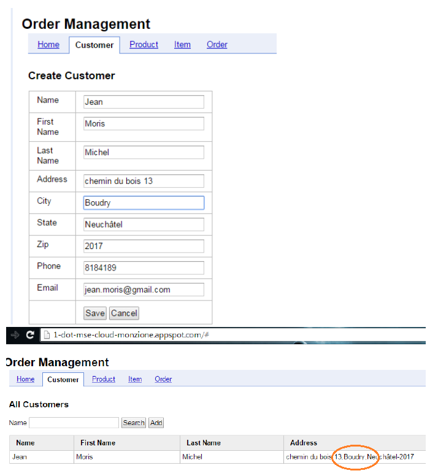
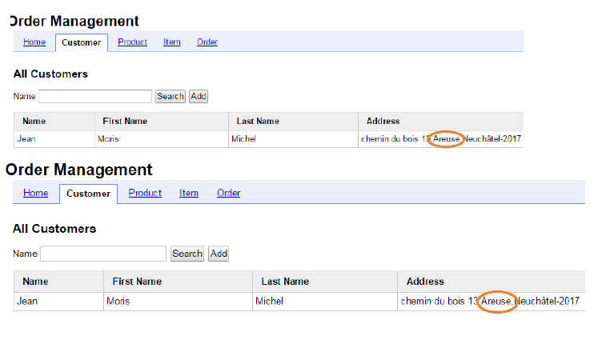

# LAB 04: DATABASE-AS-A-SERVICE AND NOSQL


Link to the full lab [here](https://cyberlearn.hes-so.ch/mod/assign/view.php?id=559004)

**Assignment from:** Laurent girod & Cyrill Zundler


## TASK 2: GET FAMILIAR WITH THE EXAMPLE CODE
#### DELIVERABLE 2:

Liste des URL qui apparaissent dans le fichier web.xml :  
+ /product géré par : ProductServlet dans com.google.appengine.codelab.ProductServlet
+ /item géré par : ItemServlet dans com.google.appengine.codelab.ItemServlet
+ /customer géré par : CustomerServlet dans com.google.appengine.codelab.CustomerServlet
+ /order géré par : OrderServlet dans com.google.appengine.codelab.OrderServlet  

La classe « baseServlet » est utilisé pour définir un model et base et définir que le JSON sera utilisé.
L’écriture et la lecture sont déléguées à la classe « util » qui utilise les services proposé par la classe « DatastoreService ».

## TASK 3: COMPLETE THE EXAMPLE CODE WITH TRANSACTIONS
####  DELIVERABLE 3:

Here is the source for writing :

```java
Transaction txn = datastore.beginTransaction();
try {
  // perform Datastore reads and writes here
  datastore.put(entity);
  // try to commit the transaction
  txn.commit();
}
finally {
  // Verify if transaction was successful. If not, roll it back.
  if (txn.isActive()) {
    txn.rollback();
  }
  else {
    // Transaction was successful.
    // Update the cache so that it remains in sync with the Datastore.
    addToCache(key, entity);
  }
}
```
Here is the source for deleting :

```java
Transaction txn = datastore.beginTransaction();
try {
  // perform Datastore reads and writes here
  datastore.delete(key);
  // try to commit the transaction
  txn.commit();
}
finally {
  // Verify if transaction was successful. If not, roll it back.
  if (txn.isActive()) {
    txn.rollback();
  }
  else {
    // Transaction was successful.
    // Update the cache so that it remains in sync with the Datastore.
    deleteFromCache(key);
  }
}

```

The app doesn't prohibits conflicts between users, once the modifications done, each users see his own modification until they refresh the page, at this time this is the last editing value appears for the two users.







If you want avoid that, for example you can use a "version" field as we have discuss in classes.
