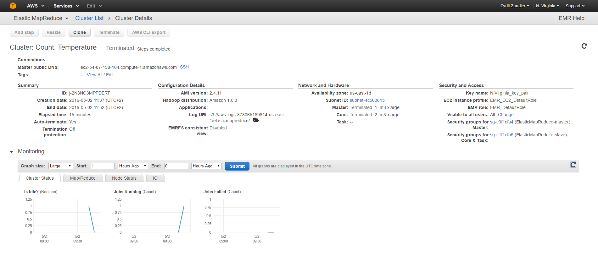
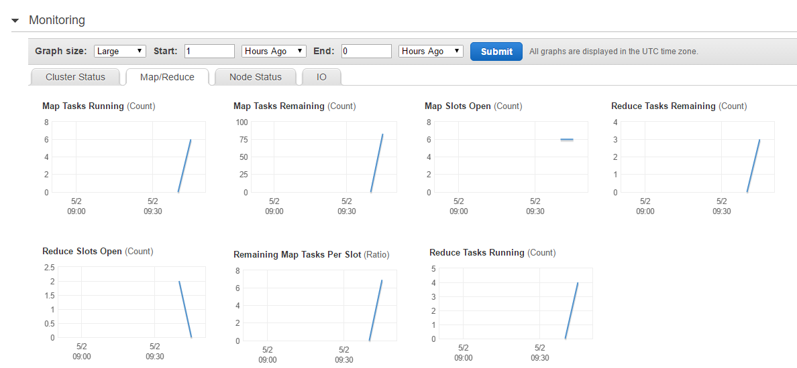
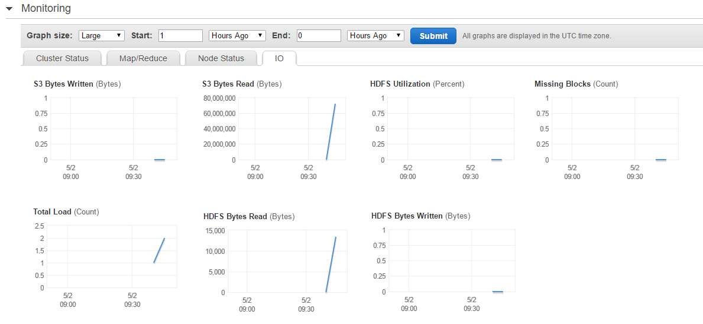

# LAB 05: MAPREDUCE IN THE CLOUD


Link to the full lab [here](https://cyberlearn.hes-so.ch/mod/assign/view.php?id=560666)

**Assignment from:** Laurent girod & Cyrill Zundler


## TASK 1: USING ELASTIC MAPREDUCE
#### DELIVERABLES 1:

Some screenshots of EMR console :






Here is the histogram from maximum temperature by years :


The overall highest temperature in the data set is the years 2003 with 38 °C

**How many EC2 instances were created to run the job ?**

According to the lab instructions :   
Step 2: Hardware
+ Master: EC2 instance type: m3.xlarge, Count: 1
+ Core: EC2 instance type: m3.xlarge, Count: 2
+ Task: Count: 0

Since I can't see anymore how many instances was running when the status is terminated, I'm based to the hardware config. So 3 instances were created.

**How much Amazon charges for this job ?**


The cluster was running during 10 min. But it counts as one hour.

Estimated price : 0.266 \* 3 instances + 0.070. = ~0.868$


**From the Hadoop statistics in the syslog log file determine**

+ Number of input key-value pairs processed by the mappers : 2831380
+ Number of input key-value pairs processed by the reducers: 2821078


## TASK 2: WRITING A MAPREDUCE PROGRAM
#### DELIVERABLES 2:


Here is the Mapper script :  
```python
#!/usr/bin/env python

import re   # import regular expressions
import sys  # import system-specific parameters and functions


# loop through the input, line by line
for line in sys.stdin:
	val = line.strip()
	(temp, q) = (val[87:91], val[92:93])

	# extract values for year, temperature and quality indicator
	# temperature is valid if not +999 and quality indicator is
	# one of 0, 1, 4, 5 or 9
	if (temp != "+999" and re.match("[01459]", q)):
		print "%s\t1" % (temp) #cle - valeur
```

Here is the Reducer script :  
```python
#!/usr/bin/env python

import sys

(last_key, max_val) = (None, -sys.maxint)
somme_temp = 0
# loop through the input, line by line
for line in sys.stdin:
	# each line contains a key and a value separated by a tab character
	(key, val) = line.strip().split("\t")
	# Hadoop has sorted the input by key, so we get the values
	# for the same key immediately one after the other.
	# Test if we just got a new key, in this case output the maximum
	# temperature for the previous key and reinitialize the variables.
	# If not, keep calculating the maximum temperature.
	if last_key and last_key != key:
		print "%s\t%s" % (last_key,somme_temp)
		last_key = key
		somme_temp = 1
	else:
		(last_key, valTmp) = (key, int(val))
		somme_temp += valTmp


# we've reached the end of the file, output what is left
if last_key:
	print "%s\t%s" % (last_key,somme_temp)
```


**Important note :** I added the +0 and -0 for simplification, just note is due to lab instructions : "To simplify things you don't need to convert the temperatures to floats or integers. It is OK to just truncate the string. The string +000 represents values between 0 and 0.9 degrees, the string -000 values between -0.9 and 0.".  

According to me, we can modify the Reducer script to :

```python
from math import floor
#...
else:
  (last_key, valTmp) = (key, floor(val+0.5)) # use of floor instead of int
  somme_temp += valTmp
#...
```

We probably get better result.

**Questions :**

+ The temperature 22 degrees celsius occur 56530 time.

+ The lowest and highest temperature occuring are +38 with 2 occurrences and -25 with 5 occurrences.

+ The temperature 0 occurs most often but is due to -0.9 to +0.9 are converted to 0 so it is biased.
